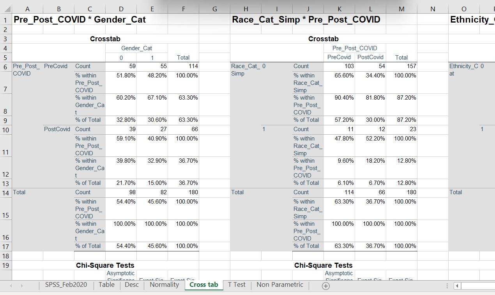
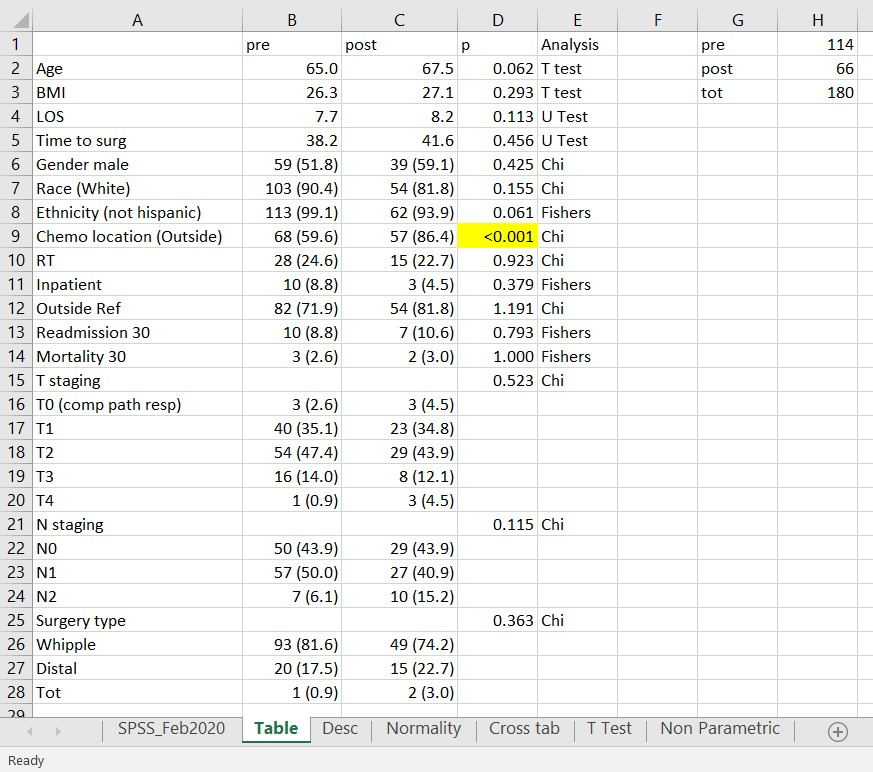
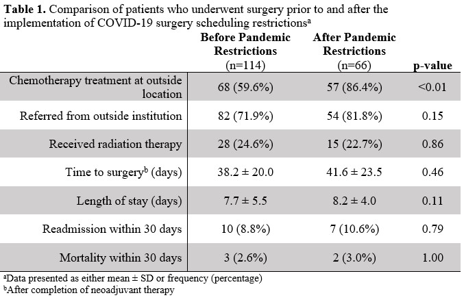

```{r setup, include=FALSE}
library(dplyr)
library(knitr)
library(kableExtra)
library(gdata)
library(flextable)
library(readr)
library(readxl)
library(rkfinal)

knitr::opts_chunk$set(echo = TRUE, tidy.opts = list(width.cutoff = 60), tidy = TRUE)
```

## Introduction (Backgrround/Motivation)

|     I am a general surgery resident currently taking two years off to do research in a pancreatic cyst and cancer lab. My specific focuses are on early detection of pancreatic cancer and improving clinical and perioperative outcomes for hepatobiliary surgeries. 

|     Thus, the majority of my research projects involve creating and synthesizing databases of patient data looking for significant associations or risk factors for better or worse outcomes. Once the database is complete, I usually then conduct my data analysis on software such as SPSS, and then create tables and figures for abstracts or manuscripts by hand. This process is often long and cumbersome on my part, as the output for SPSS is usually cluttered and requires me manually selecting the correct statistical tests, extracting appropriate summary statistics, and collating p-values into tables. 

|     For my final class project, I built an R package that would help automate some of the process above.

|     For example, earlier this year, I conducted a study looking at the impact of the COVID pandemic on the management of patients with resectable pancreatic cancer who undergo neoadjuvant chemotherapy (chemotherapy prior to surgery), our primary aim being to determine whether the pandemic delayed patients’ surgeries. For this study, I compared patients pre- and post- pandemic using the appropriate tests – for instance, I used students t-tests for normally distributed continuous variables like Age and BMI, and nonparametric U-tests for non-normally distributed continuous variables. I then used Fisher’s exact tests or Chi-square tests for categorical variables. The output I get from SPSS (transferred to Excel) was very cluttered and cumbersome, looking like: 

```{r excel ouptut screenshot, echo=FALSE, out.width="65%",fig.cap="Enormous SPSS Output", fig.align='center'}

```

My rough, manually made table looked something like this (on Microsoft excel): 


```{r excel screenshot, echo=FALSE, out.width="50%",fig.cap="Manual COVID Excel Table", fig.align='center'}

```

|     I then made a nicer appearing table on Microsoft Word to submit with an abstract to a conference:

```{r word screenshot, echo=FALSE, out.width="50%",fig.cap="Nicer Manual Word Table", fig.align='center'}

```

|     I do the above process for many of my research projects. I would like to build an R package that would essentially automate making the above tables with minimal adjustments/input by the user.

## Install my package
Use the following codes to install my package:

```{r package installation, include=FALSE, eval=TRUE}
library(devtools)
install_github("rckim/rkfinal")
```


## Importing Data and Sorting Data - Example 1

First, the user should import their data. These days, most data is saved as an excel (or .xlsx) file. For my first example, I will use my COVID data, which I've included in this R package file:

```{r data import, include=TRUE, eval=TRUE}
myData <- read_excel("COVID_PancCA.xlsx")
```

Then, the user should filter their data based on their filtering variable. In this first example, the filter variable is "Include_Neoadj"

```{r data filter, include=TRUE, eval=TRUE}
myFilteredData <- myData %>% filter(Include_Neoadj==1)
```

Next, the user identifies their grouping variable, and will place it in a new variable called "independent", to be used for the remainder of the package. They should then name the levels of their grouping variable in the vector GroupNames. In this first example, the grouping variable is "Pre_Post_COVID"

```{r data grouping, including = TRUE, eval = TRUE}
myFilteredData$independent <- myFilteredData$Pre_Post_COVID
GroupNames <- c("Pre-Covid", "Post-Covid")
```

Next the user should define their categorical and continuous variables in the new vectors CatNames and ContNames, respectively. In this example, Gender, Race, and Ethnicity are our categorical variables, while Age, BMI, Time to Surgery, and LOS (length of stay) are our continuous variables 

```{r variable identify, include=TRUE, eval=TRUE}
CatNames <- c("Gender_Cat", "Race_Cat_Simp", "Ethnicity_Cat")
ContNames <- c("Age", "BMI", "Time_to_Surg", "LOS")
```

## Categorical Variables - Example 1

Now We will analyze our categorical variables. First, we must make sure our categorical variables are in factor format. To do so we will use the ConvertToCat function included in the package

```{r demo convert to cat, eval=TRUE}
myFilteredData[CatNames] <- ConvertToCat(myFilteredData, CatNames)

```

Next, we will analyze our categorical variables, using Chi-Squared tests, or if the expected value is <5, we will use Fisher's Exact tests. This process is defined in the function CatFunctTest, also included in the package.

```{r categorical analysis, eval=TRUE, warning=FALSE}
CatOutput <- CatFunctTest(myFilteredData, CatNames)
CatOutput

```
The table is then generated from the myCatTable function, also included in the package

```{r first categorical table, include=TRUE, eval=TRUE, warning=FALSE}
myCatTable(CatOutput)
```

## Continuous variables - Example 1

Next, we will analyze our continuous variables. To do this, we will first subset out the continuous variables into a new datafram ContData

```{r continuous subset, eval=TRUE, include=TRUE}
ContData <- myFilteredData %>% select(all_of(ContNames),independent)
```

Then we can look at the distribution for our continuous data using the Shiny App created for the package: contDataApp.R (you will need to un-comment out the lines of code after doing the above)

Next we will do our statistical analysis. This will use a Student's t-Test, if the data is normally distributed (determined by the Shapiro-Wilk test for normality), or the Mann-Whitney U-test for non-normal data. This process is defined in the function ContFuncTest, included in the package. 

```{r Continuous analysis, eval=TRUE, warning=FALSE}
ContOutput <- ContFuncTest(ContData,ContNames)
ContOutput
```

Finally, to make our table, we use the myContTable function

```{r continuous table, eval=TRUE, include=TRUE, warning=FALSE}
myContTable(ContOutput)
```
## Testing the package: Example 2

For our second example, I will generate a sample dataset to use. I've included it in this package folder: sample_data.rda. This data has two continuous variables (Cont_var_1 and Cont_var_2) and two categorical variables (Cat_var_1 and cat_var_2). The grouping variable is Group_var. This time, I will run the code as one chunk, rather than piecemealing it. 

```{r example 2 data, include=TRUE, eval=TRUE, warning=FALSE}
myFilteredData <- sample_data
myFilteredData$independent <- myFilteredData$Group_var
GroupNames <- c("Group 1", "Group 2")
CatNames <- c("Cat_var_1", "Cat_var_2")
ContNames <- c("Cont_Var_1", "Cont_var_2")

myFilteredData[CatNames] <- ConvertToCat(myFilteredData, CatNames)
CatOutput <- CatFunctTest(myFilteredData, CatNames)
myCatTable(CatOutput)

ContData <- myFilteredData %>% select(all_of(ContNames),independent)
ContOutput <- ContFuncTest(ContData,ContNames)
myContTable(ContOutput)
```

## Future Work and Plans
I plan to use this R package to assist me with future data analyses for my project. For example, my next project will be looking at whether the location at which patients received their neoadjuvant chemotherapy affect how long they take to get to surgery. Another project  I have in the works is looking at different predictors of the development of postoperative pancreatic fistula after partial pancreatectomy when early drain amylase levels are low. All of these projects will require similar data analyses. Even for projects that require more complex data analyses outside the current scope of this package, such as those needing survival analysis or linear modeling, I can still use this package to conduct analyses on patient demographics (age, race, sex, bmi, etc)

Later, with more experience and practice, I hope to expand this package to include linear modeling and survival analysis, like generating Kaplan-Meier curves 
